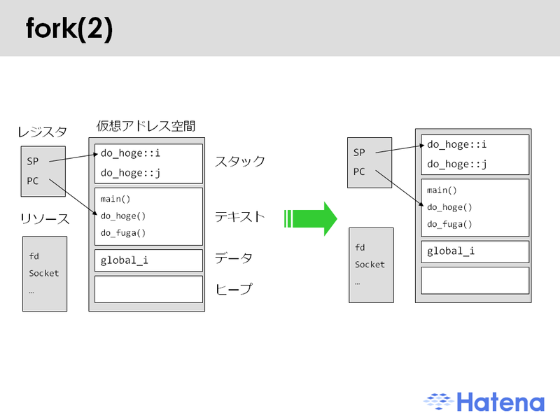
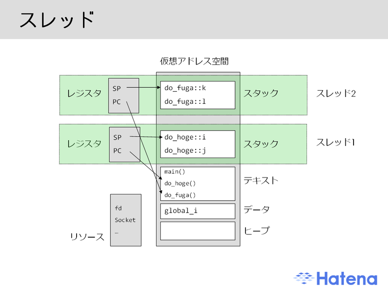

# POSIX Threads

### 2015/10/06<br />0x64 Tales<br />#01 Parallel / Concurrent

### Livesense Inc.<br />HORINOUCHI Masato

---

# pthread ってなに? (1)

* 正式名称は POSIX Threads で、その名の通り POSIX 標準の非同期処理(thread)の API 群。
  - 仕様は IEEE Std 1003.1c-1995 で定義している。
* API 群なので使用する言語は問わない。
  - 基本的に C言語向けのライブラリーを各言語に移植。

---

# pthread ってなに? (2)

* あくまで API を規定しているだけなので、どのような実装かは OS (正確には Kernel と Library) による。
* POSIX準拠のシステムであれば使用できるのはもちろん、Win32 実装もあったりする。
  - ただし 3rd party 製(現状 RedHat)。

---

# Linux のスレッド

* ところで "Linux kernel のスレッドって結局はプロセス" って話を聞いたことないですかね。
* 今回はこの点を簡単に説明することにします。

---

# pthread デモ

* [食事する哲学者の問題](https://ja.wikipedia.org/wiki/%E9%A3%9F%E4%BA%8B%E3%81%99%E3%82%8B%E5%93%B2%E5%AD%A6%E8%80%85%E3%81%AE%E5%95%8F%E9%A1%8C) を問いてみよう。
* source は [Sun Studio 12 のページ](https://docs.oracle.com/cd/E19205-01/820-1219/gevug/index.html) から持ってきました。
  - ```din_philo.c``` はデッドロックの可能性あり。
  - ```din_philo_fix1.c``` はトークン (セマフォ) を用いてデッドロックを解決している。

---

# ps -Lf

```
UID        PID  PPID   LWP  C NLWP STIME TTY          TIME CMD
horinou+ 21135  1804 21135  0    6 16:51 pts/1    00:00:00 ./din_philo
horinou+ 21135  1804 21136  0    6 16:51 pts/1    00:00:00 ./din_philo
horinou+ 21135  1804 21137  0    6 16:51 pts/1    00:00:00 ./din_philo
horinou+ 21135  1804 21138  0    6 16:51 pts/1    00:00:00 ./din_philo
horinou+ 21135  1804 21139  0    6 16:51 pts/1    00:00:00 ./din_philo
horinou+ 21135  1804 21140  0    6 16:51 pts/1    00:00:00 ./din_philo
```

* PID (process ID) が同一で LWP (thread ID) が違うスレッドを 5つ生成できた。

---

# Linux の pthreads 実装

* モダンな Linux + glibc では [Native POSIX Threads Library](https://ja.wikipedia.org/wiki/Native_POSIX_Thread_Library) (NPTL) が用いられる。
  - 初期の Linux 2.6 では LinuxThreads が用いられていた。
  - より前はユーザーランドで実装していた (名称不明)。
* Lightweight Process (LWP) を使用して実装している。
  - LWP は複数の LWP同士でリソースを共有することが可能。

---

# NPTL

* LWP とスレッドが 1:1 の実装、いわゆる 1:1 モデルを採用。
  - それぞれのスレッドが Kernel スケジュール実体に 1:1 マッピングとなる。
  - プロセスもスレッド (LWP) も task_struct 構造体で管理し、プロセススケジューリングは同一のキューで行なう。
      - 要するにプロセスとスレッドの違いはほとんとない。

---

# プロセスとスレッドのメモリ管理

* プロセス
  - fork 時に新しく仮想アドレス空間を生成し親のメモリを子にコピー。
* スレッド
  - 複数のスレッドが 1つの仮想アドレス空間を共有。

---

# プロセスの仮想アドレス空間



<sub>[マルチスレッドのコンテキスト切り替えに伴うコスト](http://d.hatena.ne.jp/naoya/20071010/1192040413) から引用。</sub>

---

# スレッドの仮想アドレス空間



<sub>[マルチスレッドのコンテキスト切り替えに伴うコスト](http://d.hatena.ne.jp/naoya/20071010/1192040413) から引用。</sub>

---

# NPTL の利点

* kernel からはスレッドもプロセス(1:1モデル)として扱えるので…
  - 1つのプロセススケジューラーだけで管理するのでシンプル。
  - SMP システムでも複数のコアでスレッドの並列処理をするのが簡単。

---

# Linux 以外だと

* ちなみに Linux 以外の POSIX システムは M:N モデル採用例が多い。
  - FreeBSD
      - Kernel Scheduler Entities (KSE)
  - Solaris
      - Solaris Lightweight Process (LWP)

---

# ご清聴ありがとうございました
