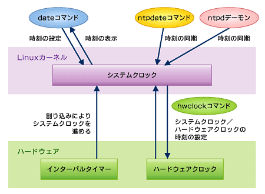
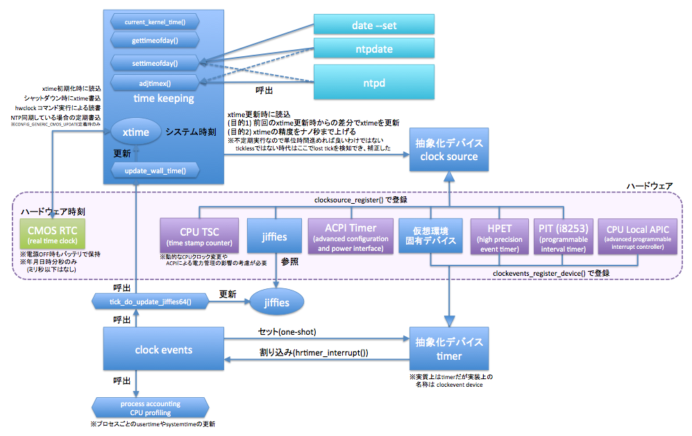

# Clock / Timer

### 2015/12/15<br />0x64 Tales<br />#03 OS Kernel

### Livesense Inc.<br />HORINOUCHI Masato

---

# Linux Kernel Clock

大別すると以下の 2つに分けられる。

* Hardware Clock
  - その名の通りハードウェア上にある Clock デバイス。
* System Clock
  - Linux Kernel 内部にある Clock で揮発性。

---



<sub>[Linux時刻管理の仕組みと設定](http://www.atmarkit.co.jp/ait/articles/0812/26/news120.html) から引用</sub>

---

# HW Clock

* Realtime Clock (RTC), BIOS Clock, CMOS Clock と呼ばれる。
* 一般的にはバッテリーバックアップが行なわれる。
  - 電源が切れていてもバッテリーやコンデンサーにより駆動。
* timezone を意識しない。UTC か localtime かわからない。
  - Windows 環境は localtime として、Linux 環境は UTC として動作するため、JST-9 環境だと 9時間のズレが発生する。

---

# System Clock

* Linux Kernel 内部のメモリーで保持している。なので揮発性。
* 2つのデータを持っている。
  - xtime: UNIX Epoch (1970/01/01 00:00:00 UTC) からの秒数
  - jiffies: 現在秒からの経過ナノ秒数
* UTC で動作する。

---

# Interval Timer

* ハードウェアにより割り込みを発生させるデバイス。
* 割り込み発生する度に jiffies を増やしていく。
  - 一般的な Linux Kernel では 1,000Hz (1ms) 毎に割り込み発生。
* jiffies の増加分を xtime に反映していく。

---

# HW Clock にアクセス

* hwclock というツールでアクセスできる。
  - hwclock は /etc/adjtime をみて UTC か localtime かを判別。

```
$ sudo hwclock --show --localtime
2015年12月15日 08時04分42秒  .785058 seconds
$ cat /etc/adjtime
0.000000 1450089054 0.000000
1450089054
UTC
```

---

# HW Clock と System Clock の関係

* SysVinit (Upstart) の場合
  - Ubuntu では `/etc/init.d/hwclock.sh` で OS 起動/終了時に同期。
  - CentOS 6 では `/etc/rc.d/init.d/halt` で OS 終了時に同期。
      - 起動時はどうしているのかちょっと調べたけど不明…。

---

# Systemd で RTC にアクセス

* timedatectl というツールでアクセスできる。

```
$ timedatectl
      Local time: 火 2015-12-15 17:06:22 JST
  Universal time: 火 2015-12-15 08:06:22 UTC
        RTC time: 火 2015-12-15 08:06:20
       Time zone: Asia/Tokyo (JST, +0900)
 Network time on: yes
NTP synchronized: yes
 RTC in local TZ: no
```

---

# Raspberry Pi

* 実は RTC を搭載していない。
* けど自作する猛者。
  - [RaspberryPiにRTCモジュールを搭載して、ハードウェア起動時に時刻を合わせる](http://qiita.com/key/items/06c2915de55d6155aa54)

---

# Tickless Kernel

* ハードウェアにより CPU に割り込み発生させると電力消費に懸念。
* 時間の更新を定期的な割り込みではなく Clock Source を参照することに。
  - これにより CPU が省電力モードでいられる時間を長くすることが可能に。

---

# Clock Source

主に以下のものがある。上にある方がアクセスコストが低い。

* kvm-clock
* Time Stamp Counter (TSC)
* High Precision Event Timer (HPET)
* ACPI Power Management Timer (ACPI_PM)
* Programmable Interval Timer (PIT)
* Real Time Clock (RTC)

---



<sub>[RHEL6のtickless kernel](http://d.hatena.ne.jp/incarose86/20110802/1312311712) から引用</sub>

---

# Clock Source を調べる

* VirtualBox 5.0.10 (準仮想化インターフェース KVM)
* Ubuntu 15.10 64bit + Guest Addtions

```
$ uname -a
Linux ubuntu 4.2.0-19-generic #23-Ubuntu SMP Wed Nov 11 11:39:30 UTC 2015 x86_64 x86_64 x86_64 GNU/Linux
$ cat /sys/devices/system/clocksource/clocksource0/available_clocksource
kvm-clock tsc acpi_pm
$ cat /sys/devices/system/clocksource/clocksource0/current_clocksource
kvm-clock
```

---

# Clock Source の速度を計測

元コード[^1] を改変して 10,000,000 回実行。

```c
#include <sys/time.h>
#include <stdio.h>

int main()
{
    struct timeval tv;
    for (int i=0; i<10000000; i++) {
        int r = gettimeofday(&tv, 0);
        if (r < 0) {
            perror("gettimeofday");
            return 1;
        }
    }
    return 0;
}
```

[^1]: [VirtualBox 5 で利用可能になった Paravirtualization 機能 kvmclock を使う](http://methane.hatenablog.jp/entry/2015/07/15/VirtualBox_5_%E3%81%A7%E5%88%A9%E7%94%A8%E5%8F%AF%E8%83%BD%E3%81%AB%E3%81%AA%E3%81%A3%E3%81%9F_Paravirtualization_%E6%A9%9F%E8%83%BD_kvmclock_%E3%82%92%E4%BD%BF%E3%81%86) から引用。

---

# 計測してみる

こんな shell script にしてみた。

```sh
#! /bin/zsh

# kvm-clock
sudo sh -c "echo kvm-clock > /sys/devices/system/clocksource/clocksource0/current_clocksource"
cat /sys/devices/system/clocksource/clocksource0/current_clocksource
time ./t

# tsc
sudo sh -c "echo tsc > /sys/devices/system/clocksource/clocksource0/current_clocksource"
cat /sys/devices/system/clocksource/clocksource0/current_clocksource
time ./t

# acpi_pm
sudo sh -c "echo acpi_pm > /sys/devices/system/clocksource/clocksource0/current_clocksource"
cat /sys/devices/system/clocksource/clocksource0/current_clocksource
time ./t
```

---

# Clock Source 考察

* kvm-clock より TSC の方が 2倍ほど速い。
  - が、VM だと TSC の値が怪しいケースも多そう。
  - なので素直に kvm-clock を使うのが良さそう。
* acpi_pm は数十倍(30〜70倍)遅い。
  - しかもシステムコールしまくり system 時間使いまくり。

---

# まとめ

* Linux Kernel の Clock / Timer 周りは歴史的経緯により複雑。
* Clock / Timer の解像度や精度は上がっている。
* 以前は VM だと Clock ズレまくったものだが、この辺も解決してきている。
  - とはいえ結局は Guest OS で ntp 使うのが良い模様 → [KVMにおいて ホストとゲストの時間管理はNTPを用いるべきか？](http://server-setting.info/centos/kvm-guest-host-ntp.html)

---

# ご清聴ありがとうございました
