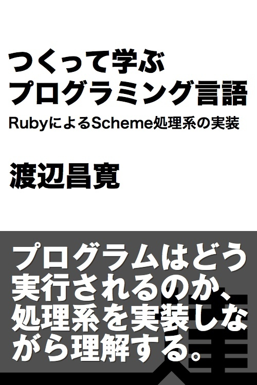
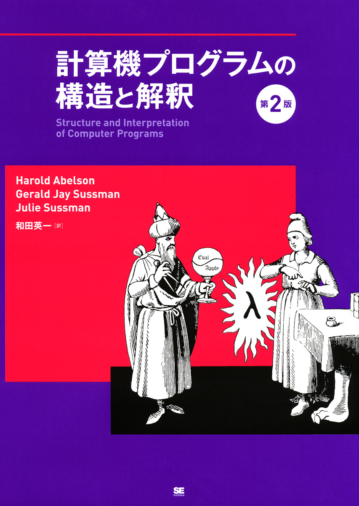

# Scheme Interpreter<br />in<br />Ruby

### 2016/01/26<br />0x64 Tales<br />#04 Compiler / Interpreter

### Livesense Inc.<br />HORINOUCHI Masato

---

# ハッカーになろう

> LISP は、それをモノにしたときのすばらしい悟り体験のために勉強しましょう。この体験は、その後の人生でよりよいプログラマーとなる手助けとなるはずです。たとえ、実際には LISP そのものをあまり使わなくても。
-- Eric S. Raymond

<sub>[ハッカーになろう (How To Become A Hacker)](http://cruel.org/freeware/hacker.html) から引用</sub>

---

# 普通のやつらの上を行け

> 彼がLispについて言っていることはよくある意見だ。つまり、Lispを学べばよいプログラマーになれる、でもそれを実際に使うことはない、と。
何故だい? プログラミング言語なんてただの道具じゃないか。Lispで良いプログラムが 書けるなら、使うべきなんだ。
-- Paul Graham

<sub>[普通のやつらの上を行け Beating the Averages](http://practical-scheme.net/trans/beating-the-averages-j.html) から引用</sub>

---

# Let's Talk Lisp

> 某イベントの二次会で「実はRubyって『MatzLisp』というLispの方言だったんだよ！」と語られたようです。何とも傑作なネタですが、Lispの強さを痛感したわたしが「自分が満足するために」作り出したRubyは、文法こそ違うものの、その本質としてLisp文化を継承しているのかもしれません。
-- まつもとゆきひろ

<sub>[Let's Talk Lisp](http://www.itmedia.co.jp/enterprise/articles/0801/29/news010_2.html) から引用</sub>

---

# 参考図書



[つくって学ぶプログラミング言語 RubyによるScheme処理系の実装](http://tatsu-zine.com/books/scheme-in-ruby) [^1]

>プログラミングをより深く理解するための近道は、プログラミング言語を実装してみること。SchemeのサブセットをRubyで実装していくことで、プログラムはどう実行されるのか、その基本がはっきり分かります。

[^1]: CC BY なので無償だよ。有償版もあるので良かったら買ってね。

---

# デモ

---

# Fibonacci number (Scheme)

```lisp
(define (fib n)
   (cond ((= n 0) 0)
         ((= n 1) 1)
         (else
          (+ (fib (- n 2)) (fib (- n 1))))))
```

---

# Fibonacci number (Ruby)

```ruby
def fib(n)
  case n
    when 0
      0
    when 1
      1
    else
      fib(n-2) + fib(n-1)
  end
end
```

---

# What is Environments.

---

# もし動的スコープだとしたら…

```lisp
((lambda (x)
   ((lambda (fun)
      ((lambda (x)
         (fun))
       1))
    (lambda () x)))
 2)
# => 1
```

↑動的スコープの Emacs Lisp では上記のコードで 1 が返ります。

---

# もし(略) (Ruby版)

```ruby
(lambda { |x|
  (lambda { |fun|
    (lambda { |x|
      fun.call
    }).call(1)
  }).call(lambda { x })
}).call(2)
```

ちなみに Ruby は静的スコープなので、あくまでコードのわかりやすさの話。

<sub>Scheme とあまり変わらないのはヒミツ…。</sub>

---

# もし(略) (y に変更)

```lisp
((lambda (x)
   ((lambda (fun)
      ((lambda (y)
         (fun))
       1))
    (lambda () x)))
 2)
# => 2
```
↑内側の (x) を (y) に変数名変更しただけで 2 になる。

---

# もし静的スコープだとしたら…

```lisp
((lambda (x)
   ((lambda (fun)
      ((lambda (x)
         (fun))
       1))
    (lambda () x)))
 2)
# => 2
```
↑ y に変更と同様 2 になる。

---

# 環境モデル

* 外側の lambda x と内側の lambda x を区別する必要がある。
  * 外側の lambda を評価しているときは {x: 2} とする。
  * 内側の lambda を評価しているときは {x: 1} とする。
* 真ん中の lambda fun を評価した際に、λ式と評価時の環境をペアとしてクロージャーを返す。

---

# closure

* クロージャーはλ式と環境のペア。
* λ式を評価するとクロージャーが評価値となる。
* クロジャーを関数適用するときは、クロージャー中の環境を用いて評価する。

## __=> 環境(静的スコープ)がないと closure は作れない。__

---

# 評価と関数適用

* 関数と引数の部分に分け、それぞれを評価する。
* 引数をその関数に適用する。
  * 関数の仮引数に実引数を束縛し、関数のボディを評価する。

## __=> 評価(eval)と関数適用(apply)を再帰的に繰り返す。__

---

# 実装

* Ruby の \_eval 関数と apply 関数を実行していく
* Scheme のリストは Ruby の Array
* Scheme の環境は Ruby の Hash の Array
  * Scheme は [Lisp-1](http://www.rubyist.net/~matz/20080201.html) なので、Hash の Array は1つだけで ok系。

---

# \_eval

```ruby
def _eval(exp, env)
  if not list?(exp)
    if immediate_val?(exp)
      exp
    else
      lookup_var(exp, env)
    end
  else
    if special_form?(exp)
      eval_special_form(exp, env)
    else
      fun  = _eval(car(exp), env)
      args = eval_list(cdr(exp), env)
      apply(fun, args)
    end
  end
end
```

---

# apply

```ruby
def apply(fun, args)
  if primitive_fun?(fun)
    apply_primitive_fun(fun, args)
  else
    lambda_apply(fun, args)
  end
end
```

---

# lookup\_var と extend\_env

```ruby
def lookup_var(var, env)
  alist = env.find { |alist| alist.key?(var) }
  if alist == nil
    raise "couldn't find value to variables: '#{var}'"
  end
  alist[var]
end

def extend_env(parameters, args, env)
  alist = parameters.zip(args)
  h     = Hash.new
  alist.each { |k, v| h[k] = v }
  [h] + env
  # ↑ 上記で env.find してるので Array の先頭に追加するのが重要。
end
```

---

# parse

```ruby
def parse(exp)
  program = exp.strip().
      gsub(/[a-zA-Z\+\-\*><=][0-9a-zA-Z\+\-=!*]*/, ':\\0').
      gsub(/\s+/, ', ').
      gsub(/\(/, '[').
      gsub(/\)/, ']')
  eval(program)
end
```
↑最後に Ruby の eval してる。

---

# Next Step



[計算機プログラムの構造と解釈](http://sicp.iijlab.net/) (通称 SICP)

> MITの入門コースで使う計算機科学の優れた教科書 ハル・エイブルソン, ジェリー・サスマン, ジュリー・サスマン共著(和田英一訳)「計算機プログラムの構造と解釈 第二版」(ピアソン・エデュケーション 2000年).   表紙の魔術師ゆえにそういわれる.   LISP/Scheme世界の聖典のひとつ.

**← 図に "Eval / Apply" の太極図 (Tao) が描かれているのにご注目。**

---

# まとめ

* LISP は構文解析が必要ないから処理系作りやすい。
* 環境モデルによって静的スコープを実現している。
* Scheme は完全な静的スコープのクロージャを持つ最初の言語として登場した。
* Scheme は偉大。

---

# ご清聴ありがとうございました
