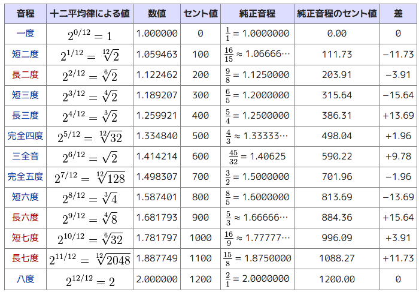

autoscale: true

# A440

### 2016/02/16 0x64 Tales #05 Number

### Livesense Inc. HORINOUCHI Masato

---

# A440 ってなに?

* オクターブ 4 の A (ラ) の周波数を 440Hz とすること。基準ピッチ(音高) として国際標準となっている。

* 1955年 に ISO により A=440 が定められる前は歴史的経緯により A=415, A=430, A=466 など様々な基準ピッチが用いられてきた。

* 少々高い基準ピッチの方が華やかに聴こえるので、現在では A=442, A=444 やそれを越えるオーケストラも多い。

---

# みんな知ってる A440

* 時報
  * [time\_signal.wav](time_signal.wav)
  * 440Hz 440Hz 440Hz 880Hz という周波数で鳴っている。

---

# オクターブ

* 1オクターブ上の音を鳴らすには周波数を 2倍にする。
* 1オクターブ下の音を鳴らすには周波数を 1/2倍にする。

* オクターブ x の A の周波数は等比数列
  * 1 => 55, 2 => 110, 3 => 220, 4 => 440, 5 => 880 …
  * `f(x) = 27.5 * (2 ** x)`

---

# 音律

音程の周波数をどのように規定するか。

* 平均律
  * 1オクターブを 12等分した音律。
  * `(0..12).each {|i| 2.0 ** (i.to_f / 12) }` の等比数列。
* 純正律
  * 純正音程(周波数比が単純な整数比となる)を用いた音律。
  * 和音で倍音のうなりが発生しない。Cメジャーでの C-E-G が 4:5:6 となる。

---

# 平均律と純正律による音程

[平均律](https://ja.wikipedia.org/wiki/%E5%B9%B3%E5%9D%87%E5%BE%8B) から引用

---

# デモ

Cメジャーで全音階と C-E-G , F-A-C , G-B-D の三和音。

* 平均律 A440: [temp\_12tet\_a440.wav](temp_12tet_a440.wav)
* 平均律 A444: [temp\_12tet\_a444.wav](temp_12tet_a444.wav)
* 純正律 A440: [temp\_just.wav](temp_just.wav)

---

# 今回の検証、 当初はリアルタイム生成した波形データを /dev/dsp に出力しようと考えていたのだが…。

---

# データどうやって作ったの?

* MML パーサー作って波形データに変換すれば良いのでは…
* 波形データさえ作れたら .wav 出力も簡単だよね。
* 波形生成関数変えれば正弦波以外も出力できるよね。
* 波形データを合成できればマルチトラック化できるよね。
* 作ってみた ← イマココ

---

# to be continued...
