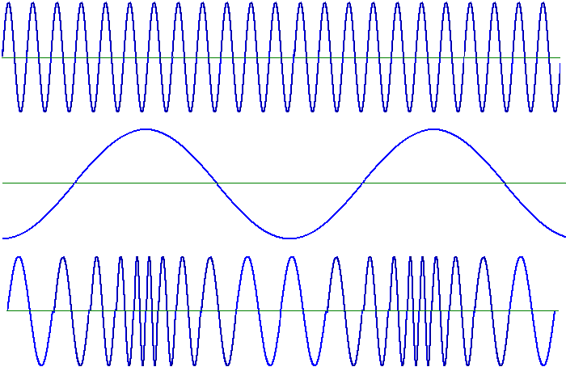
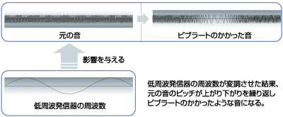
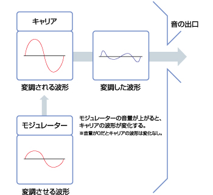
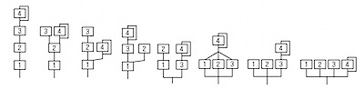
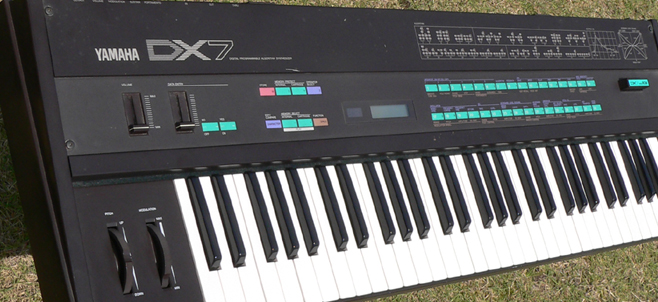
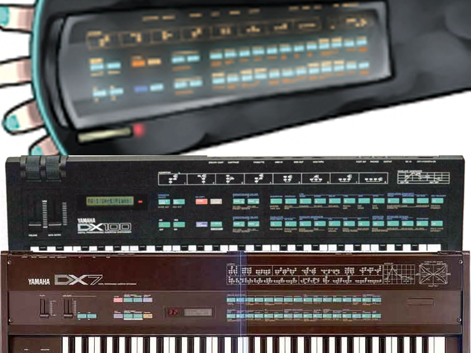

autoscale: true

# FM synthesis

### 2016/03/22 0x64 Tales #06 Wave

### Livesense Inc. HORINOUCHI Masato

---

# FM とは?

周波数変調 (frequency modulation) とは、情報を搬送波の周波数の変化で伝達する変調方式である。

上: 変調前の搬送波、中: 変調に用いる信号波、下: 送信波

[周波数変調 - Wikipedia](https://ja.wikipedia.org/wiki/%E5%91%A8%E6%B3%A2%E6%95%B0%E5%A4%89%E8%AA%BF) から引用

---

# FM音源とは?

[FM音源の原理](http://jp.yamaha.com/products/music-production/synthesizers/synth_40th/history/column/fm_tone_generation/) から引用

---

# オペレーター

* オペレーター
  * 波形生成 & 波形合成器
* モジュレーター
  * 周波数変調を行なうための波形を出力
* キャリア
  * 音の高さに合わせた周波数で発振
  * モジュレーターの波形と合成して出力

[FM音源の原理](http://jp.yamaha.com/products/music-production/synthesizers/synth_40th/history/column/fm_tone_generation/) から引用

---

# アルゴリズム

* オペレーターの繋ぎ方のパターン
* 4オペレーター (4op) の場合は、下記が一般的

[初音ミクとYAMAHAのシンセ](http://klavier.jp/blog/2010/04/05/4362/) から引用

---

# みんな知ってる FM音源の音

[YAMAHA DX7で発車メロディ (Japanese train station melody)](https://www.youtube.com/watch?v=biBCVDcaRls)

---

# YAMAHA DX7

[DX7 Librarian Page](http://dx7.roundsquare.net/) から引用

---

# VOCALOID 2 初音ミク

---

# ミクさんの腕は DX100 だった説

[今更ながら初音ミク](http://ga-j.cocolog-nifty.com/blog/2007/10/post_61c2.html) から引用

---

# みんな知ってる(かもしれない) FM音源の音

硬いベースの音やコイン取ったときの金属音がいかにもな FM音源

[SONIC THE HEDGEHOG (1991) [1 of 6]](https://www.youtube.com/watch?v=bLc8eS3miaU)

---

# オッサンホイホイ

"OP曲「TO MAKE THE END OF BATTLE」は、ゲームミュージック史上に残る名曲の一つに数えられている。" -- [イース2とは - ニコニコ大百科](http://dic.nicovideo.jp/a/%E3%82%A4%E3%83%BC%E3%82%B92)

[イース２ オープニング比較動画【ほぼ全機種】](https://www.youtube.com/watch?v=TMnKRA-koac)

---

# デモ

* ブラウザー上で動く FM Synthesizer
  * [Web FM Synthesizer made with HTML5](http://www.taktech.org/takm/WebFMSynth/)
* ブラウザー上で動くシンセサイザーを連携動作するための規格
  * [WebMidiLink](http://www.g200kg.com/en/docs/webmidilink/)

---

# まとめ

* メリット
  * FM音源の仕組みは簡単。
  * 複雑な倍音成分を持つ波形を生成できる。
  * 波形をリアルタイム生成しているため、メモリー使用効率がとても良い。

* デメリット
  * 波形を合成して音色を作るため、PCM音源と比較すると生楽器の再現性は低い。
  * パラメーター値の変動による倍音変化は予測が難しいため、音色作りがとても難しい。

---

# ご清聴ありがとうございました
