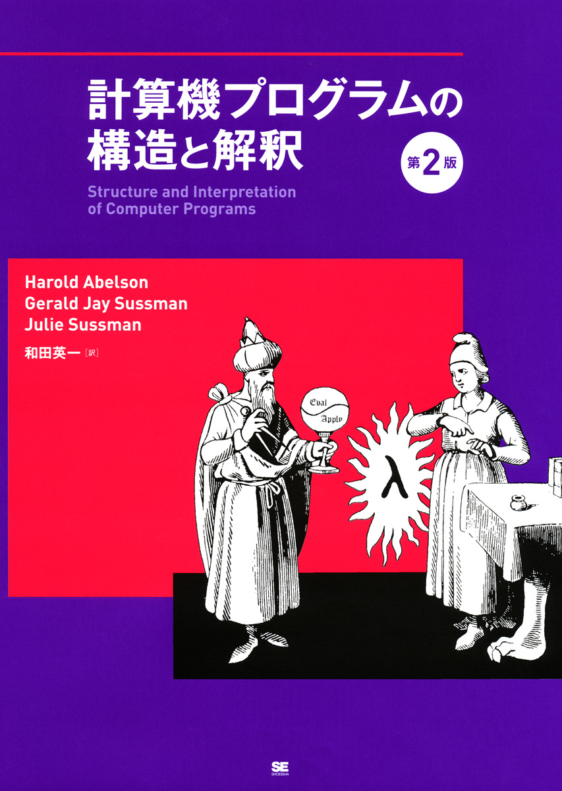

# Church Numerals

### 2018/03/26<br />0x64 Tales Reboot<br />#0x0C Lambda

### Livesense Inc. OB<br />HORINOUCHI Masato

---

# チャーチ数とは


- 自然数をラムダ式で表現する方法のひとつ
  - 関数で数値を表している

---

# ラムダ計算

- ラムダ計算で 2 + 3 = 5 を計算してみよう

---

# チャーチ数の定義

```
0 := λf x. x
1 := λf x. f x
2 := λf x. f (f x)
3 := λf x. f (f (f x))
```

↓Rubyで書くと…

```ruby
cn_0 = lambda { |f, x| x }
cn_1 = lambda { |f, x| f.call(x) }
cn_2 = lambda { |f, x| f.call(f.call(x)) }
cn_3 = lambda { |f, x| f.call(f.call(f.call(x))) }
```

---

# 後続

```
SUCC := λn f x. f (n f x)
```

↓Rubyで書くと…

```ruby
succ = lambda { |n|
         lambda { |f, x| f.call(n.call(f, x)) }
       }
```

---

# 加算

```
PLUS := λm n f x. m f (n f x)
```

↓Rubyで書くと…

```ruby
plus = lambda { |m, n|
    lambda { |f, x| m.call(f, (n.call(f, x))) }
}
```

---

# Rubyの世界へと変換

- だーっと説明してきたけど、上記で定義した関数はチャーチ数(lambda)なので…
- Rubyネイティブの数値表現に変換してあげたい。

```ruby
def cn_to_i(cn)
  cn.call(lambda { |x| x + 1 }, 0)
end
```

---

# デモ

---

# Next Step



[計算機プログラムの構造と解釈](http://sicp.iijlab.net/) (通称 SICP)

> MITの入門コースで使う計算機科学の優れた教科書 ハル・エイブルソン, ジェリー・サスマン, ジュリー・サスマン共著(和田英一訳)「計算機プログラムの構造と解釈 第二版」(ピアソン・エデュケーション 2000年).   表紙の魔術師ゆえにそういわれる.   LISP/Scheme世界の聖典のひとつ.

---

# まとめ

- SICP 読書会でチャーチ数を学んだとき、参加者全員謎の感動。
    - みんな SICP 読んでね。
- Ruby の Lambda は `.call` しないといけないので、読み書きし辛い…。

---

# ご清聴ありがとうございました
